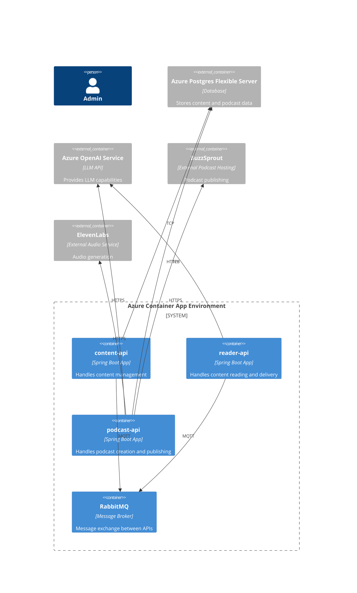

# Deployment view

## Deployment structure

```mermaid
%% C4 Container Diagram for Deployment
C4Container
      Person(admin, "Admin")
      
      Container_Ext(postgres, "Azure Postgres Flexible Server", "Database", "Stores content and podcast data")
      Container_Ext(openai, "Azure OpenAI Service", "LLM API", "Provides LLM capabilities")
      Container_Ext(buzzsprout, "BuzzSprout", "External Podcast Hosting", "Podcast publishing")
      Container_Ext(elevenlabs, "ElevenLabs", "External Audio Service", "Audio generation")
      
      System_Boundary(c1, "Azure Container App Environment") {
        Container(content_api, "content-api", "Spring Boot App", "Handles content management")
        Container(reader_api, "reader-api", "Spring Boot App", "Handles content reading and delivery")
        Container(podcast_api, "podcast-api", "Spring Boot App", "Handles podcast creation and publishing")
        Container(rabbitmq, "RabbitMQ", "Message Broker", "Message exchange between APIs")
      }
      

      Rel(content_api, postgres, "TCP")
      Rel(podcast_api, postgres, "TCP")
      Rel(reader_api, openai, "HTTPS")
      Rel(podcast_api, openai, "HTTPS")
      Rel(reader_api, rabbitmq, "MQTT")
      Rel(content_api, rabbitmq, "MQTT")

      Rel(podcast_api, elevenlabs, "HTTPS")
      Rel(podcast_api, buzzsprout, "HTTPS")
```

